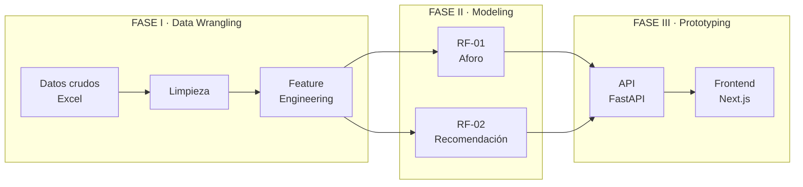
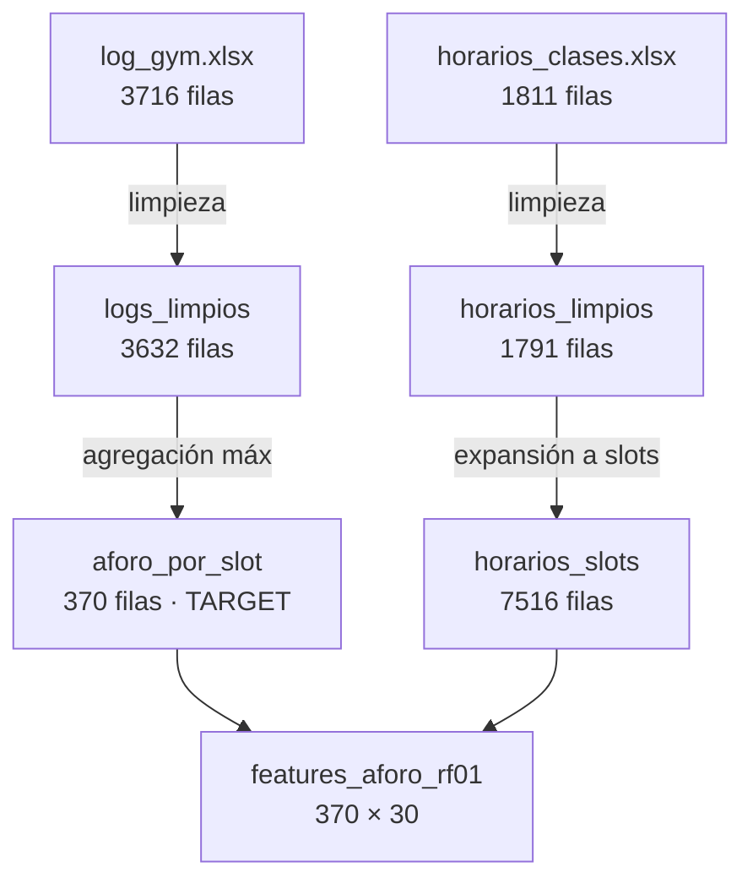
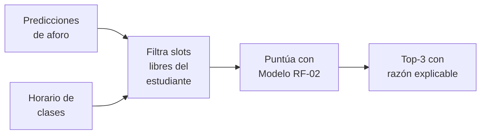
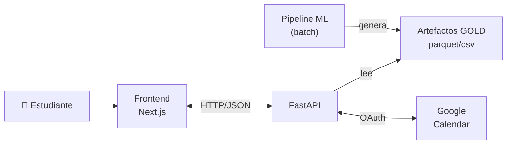

# GYMTEC — Documentación del Proceso

**Predicción de aforo y recomendación inteligente de horarios de gimnasio para UTEC**

Reporte completo del proceso de desarrollo: *data wrangling*, *modeling* y *prototyping*.

---

## Tabla de contenidos

1. [Visión general del proyecto](#1-visión-general-del-proyecto)
2. [Arquitectura de la solución](#2-arquitectura-de-la-solución)
3. [Fase I — Data Wrangling](#3-fase-i--data-wrangling)
4. [Fase II — Modeling](#4-fase-ii--modeling)
5. [Fase III — Prototyping](#5-fase-iii--prototyping)
6. [Resultados](#6-resultados)
7. [Cómo reproducir el proyecto](#7-cómo-reproducir-el-proyecto)
8. [Conclusiones y trabajo futuro](#8-conclusiones-y-trabajo-futuro)

---

## 1. Visión general del proyecto

### 1.1 Problema

El gimnasio del campus UTEC sufre congestión en ciertas franjas horarias mientras
permanece subutilizado en otras. Los estudiantes no tienen forma de saber **cuándo el gym
estará vacío** ni **qué horario encaja mejor con su agenda de clases**. Esto genera
frustración, colas y una mala distribución de la demanda.

### 1.2 Solución

GYMTEC es una aplicación que, a partir de datos históricos de uso del gimnasio y de los
horarios académicos, responde dos preguntas:

| Pregunta del estudiante | Componente que la responde |
|---|---|
| *"¿Qué tan lleno estará el gym en cada hora?"* | **Modelo 1 (RF-01)** — predicción de aforo |
| *"¿Cuál es el mejor horario para que yo vaya?"* | **Modelo 2 (RF-02)** — recomendación personalizada |

### 1.3 Funcionalidades del prototipo

- 📊 **Predicción de aforo** por día y franja horaria (mapa de calor semanal).
- 🎯 **Recomendación personalizada** del top-3 de horarios según el horario de clases del
  estudiante.
- 📅 **Integración con Google Calendar** para detectar automáticamente la disponibilidad.
- 🏋️ **Estimador de objetivos** (tiempo aproximado para alcanzar metas fitness).

---

## 2. Arquitectura de la solución

El proyecto sigue una **arquitectura de medallón** (Bronze → Silver → Gold), un patrón
estándar de ingeniería de datos que organiza la información en capas según su grado de
procesamiento.



| Capa | Carpeta | Tecnología |
|---|---|---|
| Pipeline de datos y modelos | [backend/src/](backend/src/) | Python, pandas, scikit-learn |
| API de servicio | [backend/app/](backend/app/) | FastAPI, uvicorn |
| Interfaz de usuario | [frontend/](frontend/) | Next.js 14, TypeScript, Tailwind |

---

## 3. Fase I — Data Wrangling

El objetivo de esta fase es transformar dos archivos Excel crudos y heterogéneos en una
tabla de features limpia, validada y lista para entrenar modelos. Todo el código vive en
[backend/src/data/](backend/src/data/) y [backend/src/features/](backend/src/features/).

### 3.1 Fuentes de datos (capa BRONZE)

| Fuente | Filas | Columnas | Descripción |
|---|---|---|---|
| `log_gym.xlsx` | **3 716** | 7 | Registros de ingreso/salida del gimnasio (2026-03-30 a 2026-04-24) |
| `horarios_clases.xlsx` | **1 811** | 12 | Horarios académicos del semestre 2026-1 |

**Esquema de `log_gym.xlsx`:** `student_id, facultad, carrera, genero, fecha, hora,
accion` (donde `accion` ∈ {ingreso, salida}).

**Esquema de `horarios_clases.xlsx`:** incluye `Código Curso, Curso, Sección, Modalidad,
Horario` (texto libre como `"Mar. 15:00 - 17:00"`), `Matriculados`, entre otras.

### 3.2 Limpieza (capa SILVER)

📁 [backend/src/data/clean_data.py](backend/src/data/clean_data.py)

**Limpieza de horarios académicos** (`clean_horarios`):

1. **Normalización:** espacios en blanco convertidos a `NaN`; columnas renombradas a
   snake_case con tipado explícito.
2. **Derivación de facultad:** los 2 primeros caracteres del código de curso se mapean a
   facultad (ej. `CS` → Computación) usando un diccionario de dominio.
3. **Parseo del horario:** el texto libre `"Mar. 15:00 - 17:00"` se descompone en
   `dia`, `hora_inicio`, `hora_fin`, con cálculo de `duracion_h`.
4. **Reglas de calidad:** se descartan filas sin día válido, con `matriculados = 0` o
   duración inválida.

> 📉 **Resultado:** 1 811 → **1 791 filas** (20 descartadas).

**Limpieza de logs del gimnasio** (`clean_logs_gym`):

1. **Timestamp unificado:** `timestamp = fecha + hora`.
2. **Señal de flujo:** cada acción se convierte en `+1` (ingreso) o `−1` (salida). Si
   aparece un valor no reconocido, el proceso **se detiene con error** (fail-fast).
3. **Eliminación de outliers:** se emparejan ingreso↔salida y se descartan las sesiones
   de **menos de 16 minutos** (entradas fugaces que no representan uso real).
4. **Ocupación acumulada:** suma acumulada de señales **por día** (el gimnasio se vacía
   cada noche).

> 📉 **Resultado:** 3 716 → **3 632 filas** (84 sesiones cortas descartadas).

### 3.3 Feature Engineering (capa GOLD)

📁 [backend/src/features/build_features.py](backend/src/features/build_features.py)

**Paso 1 — Expansión a slots de 30 min:** cada clase se "explota" en una fila por cada
franja de 30 minutos que ocupa.

> 📈 1 791 clases → **7 516 filas** de `(clase_id, dia, slot)`.

**Paso 2 — Cálculo del target (aforo):** de los logs se calcula el **máximo de ocupación**
dentro de cada `(fecha, slot)` — se usa el máximo para capturar el pico real del bloque.

> 📊 Genera la serie temporal `aforo_por_slot`: **370 filas**.

**Paso 3 — Tabla de features:** se construye la tabla maestra de entrenamiento con
**370 filas × 30 columnas**, organizadas en familias:

| Familia | Variables | Propósito |
|---|---|---|
| Identificadores | `fecha, dia, dia_num, slot, hora_dec` | Claves temporales |
| Target | `aforo, ratio_ocupacion, nivel_ocupacion` | Lo que predecimos |
| Lags | `aforo_lag1, aforo_lag2` | Memoria del slot anterior |
| Históricos | `aforo_prom_hist, aforo_max_hist` | Patrón recurrente por franja |
| **Cíclicas** | `hora_sin/cos, dia_sin/cos` | Continuidad circular del tiempo (23h ≈ 0h) |
| Académicas | `estudiantes_presencial/libres, carga_academica, ratio_libres` | Contexto de clases |
| Modalidad | `modalidad_predominante` | presencial / virtual / mixta / sin_clases |

> 💡 **Técnica destacada — codificación cíclica:** en lugar de tratar la hora como un
> número lineal (donde las 23h y las 0h parecerían muy distintas), se usan funciones seno
> y coseno para que el modelo entienda que el tiempo es circular.

**Manejo de nulos:** tras los cruces, todas las columnas se rellenan sistemáticamente
(enteros con `0`, decimales con `0.0`, categóricas con `"sin_clases"`). **Ningún valor
nulo llega a los modelos.**

### 3.4 Resumen del flujo de datos



---

## 4. Fase II — Modeling

Se entrenan **dos modelos complementarios**. Todo el código vive en
[backend/src/models/](backend/src/models/).

### 4.1 Modelo 1 (RF-01) — Predicción de aforo

📁 [backend/src/models/train_model.py](backend/src/models/train_model.py)

| Aspecto | Decisión |
|---|---|
| **Algoritmo** | `RandomForestRegressor` (200 árboles, `min_samples_leaf=2`) |
| **Por qué** | Dataset pequeño (~370 filas) donde el error de varianza domina; el Random Forest rinde bien sin tuning y sin dependencias extra |
| **Alternativas** | El código soporta `LinearRegression` (baseline) y `LightGBM` para comparativas, intercambiables con un parámetro |
| **Preprocesamiento** | `ColumnTransformer` con paso directo para numéricas y `OneHotEncoder` para la categórica |

**Validación temporal:** se ordenan las fechas y se usa el **primer 80% para entrenar y el
último 20% para probar**. Esto evita la fuga de información (no se entrena con datos del
"futuro"), lo cual es esencial en problemas de series temporales.

> 🎯 **Resultado: MAE = 2.63 personas · RMSE = 3.59 · R² = 0.890**
> (entrenado con 276 filas, probado con 94).

**Interpretabilidad:** el modelo revela que la variable más importante es el promedio
histórico de aforo por franja (**83.3%** de importancia), lo cual confirma que el uso del
gimnasio es altamente recurrente semana a semana.

### 4.2 Modelo 2 (RF-02) — Recomendación de horarios

📁 [backend/src/models/train_recommender.py](backend/src/models/train_recommender.py)

| Aspecto | Decisión |
|---|---|
| **Algoritmo** | Regresión `Ridge` (regularización L2) |
| **Por qué** | Relación lineal con el objetivo, coeficientes interpretables, dataset pequeño |
| **Objetivo (label)** | Score sintético en [0, 1] construido con heurísticas de dominio |

**Etiqueta sintética:** como aún no existe feedback real de usuarios, se construye un
"score de qué tan bueno es un horario" combinando:

```
score = 0.55·(gym vacío) + 0.20·(carga académica) + 0.15·(preferencia horaria) + 0.10·(no es finde)
```

> 🔄 El diseño permite **reemplazar esta etiqueta por feedback real** (clicks,
> asistencias) sin cambiar el resto del pipeline.

**Métrica clave — NDCG@3:** como el recomendador devuelve un top-3, lo que importa no es
el valor exacto del score sino **el orden**. Por eso se implementó la métrica NDCG@3
(Normalized Discounted Cumulative Gain), que mide qué tan bien rankea los mejores horarios.

> 🎯 **Resultado: MAE = 0.033 · R² = 0.927 · NDCG@3 = 0.998**

### 4.3 De modelo a recomendación

📁 [backend/src/recommendation/recommend_schedule.py](backend/src/recommendation/recommend_schedule.py)

El recomendador personalizado funciona así:



1. Toma las predicciones de aforo de todos los horarios.
2. Cruza con la disponibilidad del estudiante (sus clases).
3. Filtra solo los slots en que está libre.
4. Puntúa cada candidato con el Modelo 2 (o un fallback heurístico si el modelo no está
   disponible).
5. Devuelve los **3 mejores horarios con una explicación** ("Recomendado porque estás
   libre y el aforo esperado es bajo").

---

## 5. Fase III — Prototyping

El prototipo funcional integra los modelos en una aplicación web usable de punta a punta.

### 5.1 API de servicio (backend)

📁 [backend/app/api/main.py](backend/app/api/main.py) — **FastAPI**

La API **no recalcula nada en tiempo real**: lee los artefactos ya generados por el
pipeline y los adapta al formato que espera el frontend. Esto la hace rápida y predecible.

**Endpoints principales:**

| Método | Ruta | Función |
|---|---|---|
| `GET` | `/api/v1/health` | Estado del servicio |
| `GET` | `/api/v1/forecast/week` | Mapa de calor semanal de aforo |
| `GET` | `/api/v1/predictions/today` | Predicción del día |
| `POST` | `/api/v1/schedule` | Recibe el horario ocupado del alumno |
| `POST` | `/api/v1/recommendations/today` | Top de horarios recomendados |
| `POST` | `/api/v1/goals/estimate` | Estimación de objetivos fitness |

**Integraciones adicionales:**

- 📅 **Google Calendar** ([google_calendar.py](backend/app/api/google_calendar.py)):
  flujo OAuth 2.0 completo para leer los eventos del estudiante y derivar su
  disponibilidad automáticamente.
- 🏋️ **Estimador de objetivos** ([goals.py](backend/app/api/goals.py)): calcula el tiempo
  aproximado para alcanzar una meta fitness según peso, frecuencia e intensidad.

### 5.2 Interfaz de usuario (frontend)

📁 [frontend/](frontend/) — **Next.js 14 + TypeScript + Tailwind CSS**

Aplicación móvil-first con las pantallas:

| Pantalla | Función |
|---|---|
| **Hoy** | Mejor horario recomendado y predicción intra-día |
| **Semana** | Mapa de calor de ocupación por día y hora |
| **Horario** | Conexión con Google Calendar para cargar clases |
| **Objetivos** | Estimador de metas fitness |
| **Recomendaciones** | Top-3 personalizado con explicación |

> 🛡️ **Degradación elegante:** si el backend está caído, el frontend muestra datos de
> demostración ([mockData.ts](frontend/src/data/mockData.ts)) en lugar de romperse,
> mostrando un aviso discreto al usuario.

### 5.3 Flujo completo en producción



---

## 6. Resultados

### 6.1 Métricas de los modelos

| Modelo | Tarea | Métrica principal | Valor |
|---|---|---|---|
| RF-01 | Predicción de aforo | R² | **0.890** |
| RF-01 | Predicción de aforo | MAE | **2.63 personas** |
| RF-02 | Recomendación (ranking) | NDCG@3 | **0.998** |
| RF-02 | Recomendación (ranking) | R² | **0.927** |

### 6.2 Artefactos generados por el pipeline

| Artefacto | Contenido | Volumen |
|---|---|---|
| `aforo_por_slot.parquet` | Serie histórica de ocupación | 370 filas |
| `features_aforo_rf01.parquet` | Tabla de entrenamiento | 370 × 30 |
| `predicciones_aforo.parquet/csv` | Aforo predicho por franja | 100 filas |
| `recomendaciones_horario.parquet/csv` | Top-3 por estudiante | demo |
| `rf01_aforo_baseline.pkl` | Modelo de aforo entrenado | — |
| `rf02_recomendador_score.pkl` | Modelo de recomendación | — |

### 6.3 Interpretación

- El **R² de 0.890** en predicción de aforo indica que el modelo explica el 89% de la
  variabilidad de la ocupación — un resultado sólido para un MVP con ~26 días de datos.
- El **NDCG@3 de 0.998** confirma que el recomendador ordena casi perfectamente los
  mejores horarios para el estudiante.
- La importancia dominante del histórico por franja valida la hipótesis de negocio: **el
  uso del gimnasio es predecible porque es recurrente**.

---

## 7. Cómo reproducir el proyecto

```bash
# 1. Instalar dependencias del backend
cd backend
pip install -r requirements.txt

# 2. Colocar los Excel crudos en data/raw/
#    (log_gym.xlsx, horarios_clases.xlsx)

# 3. Ejecutar el pipeline completo (limpieza → features → modelos → predicciones)
python -m src.run_pipeline

# 4. Levantar la API
uvicorn app.api.main:app --reload --port 8000

# 5. Levantar el frontend (en otra terminal)
cd ../frontend
npm install && npm run dev
```

> 💡 En Windows, el script [start.ps1](start.ps1) levanta backend (8000) y frontend (3000)
> simultáneamente.

El pipeline es **idempotente y reejecutable**: se orquesta en 6 etapas secuenciales desde
[backend/src/run_pipeline.py](backend/src/run_pipeline.py).

---

## 8. Conclusiones y trabajo futuro

### 8.1 Lo logrado

✅ Pipeline de datos completo y automatizado (Bronze → Silver → Gold).
✅ Dos modelos entrenados, validados y con buen desempeño (R²=0.890, NDCG@3=0.998).
✅ Prototipo web funcional de punta a punta con integración a Google Calendar.
✅ Arquitectura que separa cómputo batch (pipeline) de servicio online (API).

### 8.2 Próximos pasos

| Mejora | Beneficio |
|---|---|
| Recolectar **feedback real** de usuarios | Reemplazar la etiqueta sintética del recomendador |
| Acumular **más historia** de logs | Robustecer el modelo y migrar a LightGBM |
| **Tests unitarios** sobre feature engineering | Asegurar calidad ante cambios |
| **Estado externo** (Redis) en el serving | Soportar concurrencia multi-usuario |
| **Reentrenamiento programado** (cron/Airflow) | Mantener el modelo actualizado |

---

*Documento de proceso GYMTEC — fases de data wrangling, modeling y prototyping.
Las métricas y volúmenes fueron verificados directamente sobre los artefactos del
repositorio.*
