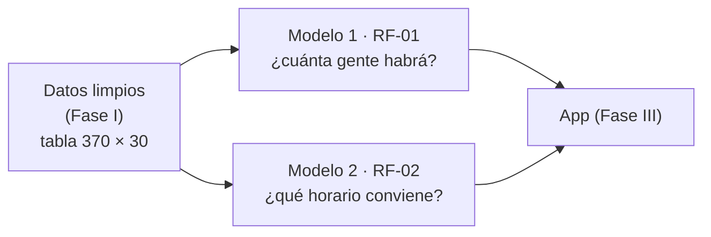
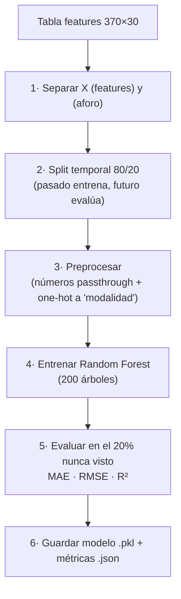
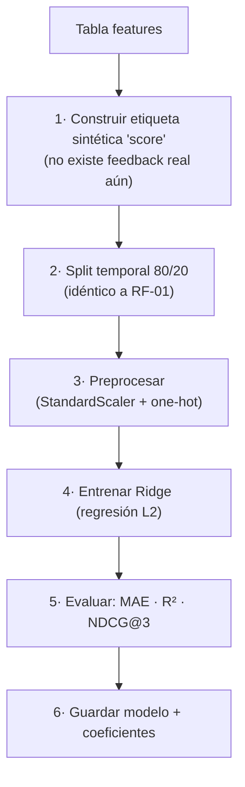
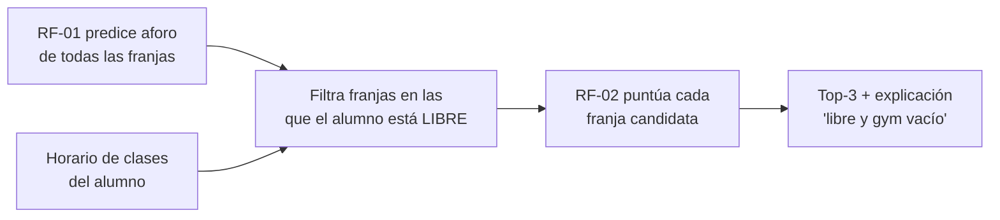

# GYMTEC — Informe detallado del Modelamiento (Fase II)

**Predicción de aforo y recomendación de horarios del gimnasio UTEC**

Este documento explica **qué es el modelamiento del proyecto, por qué se hace así y qué
entra / qué sale en cada etapa**. Está escrito para entenderse de principio a fin sin
mirar el código, pero indica en qué archivo vive cada cosa por si se quiere verificar.

---

## 0. Idea en una frase

> A partir de datos históricos de uso del gimnasio, **enseñamos a dos modelos**: uno aprende
> a **predecir cuánta gente habrá** en cada franja horaria, y otro aprende a **ordenar los
> mejores horarios** para que un estudiante vaya. El modelamiento es el puente entre los
> datos ya limpios (Fase I) y la aplicación que usa el alumno (Fase III).



---

## 1. ¿Qué significa "modelar" aquí?

Modelar = encontrar una **función matemática** que, dado un conjunto de datos de entrada
(las *features* o características), produzca una predicción de salida.

```
            entrada (X)                       salida (y)
   [día, hora, histórico, clases...]  ──►  número de personas en el gym
```

El modelo **no se programa a mano**: se le muestran cientos de ejemplos del pasado
(situación → cuánta gente hubo) y él **aprende solo** el patrón. A eso se le llama
*entrenar*. Hacemos esto dos veces porque resolvemos dos preguntas distintas:

| | Modelo 1 (RF-01) | Modelo 2 (RF-02) |
|---|---|---|
| **Pregunta** | ¿Cuántas personas habrá a tal hora? | ¿Qué tan bueno es este horario para ir? |
| **Tipo de problema** | Regresión (predice un número) | Regresión + ranking (ordena opciones) |
| **Salida** | Aforo estimado (ej. "14 personas") | Score 0–1 y un Top-3 ordenado |
| **Algoritmo** | Random Forest | Ridge (regresión lineal regularizada) |
| **Archivo** | `backend/src/models/train_model.py` | `backend/src/models/train_recommender.py` |

> **Clave conceptual:** son **complementarios**. El Modelo 2 se apoya en lo que predice el
> Modelo 1 (un horario es "bueno", en parte, porque el gym estará vacío). Primero estimamos
> aforo, luego puntuamos horarios usando ese aforo.

---

## 2. Qué ENTRA al modelamiento (la frontera con la Fase I)

El modelamiento **no toca los Excel crudos**. Recibe **una sola tabla ya limpia y
enriquecida** que produjo la Fase I:

📄 `features_aforo_rf01.parquet` → **370 filas × 30 columnas**

- **1 fila = 1 franja de 30 minutos de un día concreto** (ej. "martes 30/04, 15:00–15:30").
- Las **columnas** son las características de esa franja, agrupadas en familias:

| Familia | Ejemplos de columnas | Qué le dice al modelo |
|---|---|---|
| **Tiempo** | `dia_num`, `hora_dec` | Cuándo es la franja |
| **Tiempo cíclico** | `hora_sin/cos`, `dia_sin/cos` | Que 23 h y 0 h están "pegadas" (el reloj es circular) |
| **Memoria reciente** | `aforo_lag1`, `aforo_lag2` | Cuánta gente hubo en las franjas inmediatamente anteriores |
| **Patrón histórico** | `aforo_prom_hist`, `aforo_max_hist` | Cómo suele estar *esa misma franja* otras semanas |
| **Contexto académico** | `estudiantes_presencial`, `carga_academica`, `ratio_libres` | Cuánta gente está en clase (no compite por el gym) |
| **Modalidad** | `modalidad_predominante` | Si predominan clases presenciales / virtuales / sin clases |
| **TARGET** | `aforo` | **La respuesta correcta**: cuánta gente hubo realmente |

> **Por qué importa esta frontera:** la calidad del modelo depende casi por completo de esta
> tabla. "Garbage in, garbage out". Por eso la Fase I (limpieza + feature engineering) es
> tan grande: el modelamiento solo es bueno si lo que entra ya viene ordenado.

### La columna especial: el *target*

`aforo` es la **respuesta conocida** de cada fila histórica. El modelo aprende mirando
muchos pares *(features → aforo real)*. En producción ya no tendremos `aforo` (es lo que
queremos adivinar), pero para **entrenar** sí lo necesitamos: es como darle a un alumno
exámenes resueltos para que aprenda, antes de tomarle uno nuevo.

### 2.1 — El esquema completo de las 30 columnas

Esta es la tabla `features_aforo_rf01.parquet` **columna por columna**, tal como la produce
`backend/src/features/build_features.py`. La columna **"Rol en el modelo"** indica el destino
de cada una cuando llega al modelamiento (esto es lo que hay que tener claro):

| # | Columna | Tipo | Ejemplo | Rol en el modelamiento |
|---|---|---|---|---|
| 1 | `fecha` | fecha | 2026-04-30 | **Identificador** → se usa solo para el split temporal, **no entra como feature** |
| 2 | `dia` | texto | "Jueves" | Identificador (no entra; su versión numérica sí) |
| 3 | `dia_num` | int (0–6) | 3 | ✅ Feature numérica |
| 4 | `slot` | texto | "15:00" | Identificador (no entra; su versión decimal sí) |
| 5 | `hora_dec` | float | 15.0 | ✅ Feature numérica |
| 6 | `aforo` | int | 14 | 🎯 **TARGET** (RF-01) — lo que se predice |
| 7 | `aforo_max` | int | 30 | Auxiliar (se usa para el ratio y para RF-02) |
| 8 | `ratio_ocupacion` | float | 0.47 | Derivado del target (no entra como feature en RF-01) |
| 9 | `nivel_ocupacion` | texto | "Medio" | Etiqueta legible (no entra al modelo) |
| 10 | `aforo_lag1` | int | 11 | ✅ Feature — aforo del slot anterior del mismo día |
| 11 | `aforo_lag2` | int | 9 | ✅ Feature — aforo de dos slots antes |
| 12 | `aforo_prom_hist` | float | 13.2 | ✅ Feature — promedio de *ese* (día,slot) en el histórico |
| 13 | `aforo_max_hist` | float | 22 | ✅ Feature — máximo histórico de *ese* (día,slot) |
| 14 | `hora_sin` | float | 0.0 | ✅ Feature cíclica |
| 15 | `hora_cos` | float | −1.0 | ✅ Feature cíclica |
| 16 | `dia_sin` | float | 0.43 | ✅ Feature cíclica |
| 17 | `dia_cos` | float | −0.90 | ✅ Feature cíclica |
| 18 | `es_finde` | int (0/1) | 0 | ✅ Feature |
| 19 | `es_dia_academico` | int (0/1) | 1 | ✅ Feature |
| 20 | `estudiantes_presencial` | int | 320 | ✅ Feature |
| 21 | `estudiantes_virtual` | int | 40 | ✅ Feature |
| 22 | `estudiantes_libres` | int | 680 | ✅ Feature |
| 23 | `ratio_libres` | float | 0.68 | ✅ Feature |
| 24 | `carga_academica` | float | 0.32 | ✅ Feature |
| 25 | `ratio_virtual` | float | 0.11 | ✅ Feature |
| 26 | `n_secciones_activas` | int | 18 | ✅ Feature |
| 27 | `n_cursos_activos` | int | 12 | ✅ Feature |
| 28 | `n_facultades_activas` | int | 5 | ✅ Feature |
| 29 | `duracion_prom_clases` | float | 1.8 | ✅ Feature |
| 30 | `modalidad_predominante` | texto | "presencial" | ✅ **Feature categórica** (única que se codifica con one-hot) |

**Conteo que conviene mencionar en la defensa:**
- **30 columnas** en total.
- **5 identificadores/legibles** que NO entran al modelo (`fecha`, `dia`, `slot`,
  `nivel_ocupacion`, y `aforo_max`/`ratio_ocupacion` como auxiliares).
- **1 target** (`aforo`).
- **23 features de entrada**: **22 numéricas + 1 categórica** (`modalidad_predominante`).

> Estas 23 son exactamente las listas `NUMERIC_FEATURES` (22) y `CATEGORICAL_FEATURES` (1)
> declaradas al inicio de `train_model.py`. **El modelo no ve nada más.**

### 2.2 — De dónde nace cada columna (traza rápida a Fase I)

Para que el profesor vea que ninguna columna es arbitraria, este es su origen:

| Grupo de columnas | Se calcula en (Fase I) | A partir de |
|---|---|---|
| `aforo`, `aforo_max`, `ratio_ocupacion`, `nivel_ocupacion` | `construir_aforo_por_slot()` | Logs del gym: **máximo** de ocupación por (fecha, slot) |
| `aforo_lag1/2`, `aforo_prom_hist`, `aforo_max_hist` | `construir_features_aforo_rf01()` | Desplazar y promediar la serie de `aforo` |
| `hora_sin/cos`, `dia_sin/cos`, `es_finde` | idem | Funciones seno/coseno sobre `hora_dec` y `dia_num` |
| `estudiantes_*`, `ratio_*`, `carga_academica`, `n_*`, `duracion_prom_clases`, `modalidad_predominante` | `construir_features_academicas()` | Horarios de clase expandidos a slots, agregados por (día, slot) |

> Ejemplo de por qué son útiles: `carga_academica` alta = mucha gente en clase = menos gente
> disponible para el gym. El modelo aprende esa correlación por sí solo.

---

## 3. MODELO 1 (RF-01) — Predicción de aforo, etapa por etapa

📄 `backend/src/models/train_model.py`



### Etapa 1 — Separar entrada (X) y respuesta (y)
- **Entra:** la tabla completa (30 columnas).
- **Sale:** dos objetos.
  - `X` = las **23 columnas de features** → `feat_cols = NUMERIC_FEATURES + CATEGORICAL_FEATURES`.
  - `y` = la columna **`aforo`** (el target).
- **Qué columnas se DESCARTAN aquí y por qué:**

| Columna descartada | Motivo |
|---|---|
| `fecha`, `dia`, `slot` | Identificadores; solo sirven para ordenar/cortar en el tiempo. Si entraran, el modelo "memorizaría" fechas en vez de aprender el patrón. |
| `aforo` | Es la respuesta (`y`), no puede estar también en la entrada. |
| `aforo_max` | Constante (30); no aporta información. |
| `ratio_ocupacion`, `nivel_ocupacion` | Se derivan del target → meterlas sería *fuga de información* (le estaríamos dando la respuesta disfrazada). |

- **Filtro previo:** también se eliminan las filas sin `aforo` (`dropna(subset=["aforo"])`),
  porque no se puede aprender de un ejemplo sin respuesta conocida.

### Etapa 2 — Split temporal 80/20 (la decisión más importante)
- **Entra:** las filas con su fecha.
- **Sale:** `train` = el **80 % más antiguo** de las fechas; `test` = el **20 % más
  reciente**. (En este dataset: 276 filas para entrenar, 94 para probar.)
- **Por qué NO se parte al azar:** esto es una **serie temporal**. Si entrenáramos con datos
  del futuro y evaluáramos con el pasado, el modelo "haría trampa" (fuga de información /
  *data leakage*) y las métricas saldrían infladas. Partir por tiempo simula la realidad:
  *aprende del pasado, predice el futuro*. Es exactamente lo que pasará en producción.

> Si el profesor solo entiende una cosa de RF-01, que sea esta: **el corte es por fecha, no
> aleatorio**, porque predecir el futuro con el futuro no demuestra nada.

### Etapa 3 — Preprocesamiento (`ColumnTransformer`)
- **Entra:** `X` con 23 columnas de distinto tipo (22 números + 1 texto).
- **Sale:** una matriz **puramente numérica** de ~26 columnas que el algoritmo entiende.
- **Qué le hace a cada bloque de columnas:**

| Columnas | Transformación | Resultado |
|---|---|---|
| Las 22 numéricas (`dia_num`, `hora_dec`, `aforo_lag1/2`, `aforo_prom_hist`, `aforo_max_hist`, `hora_sin/cos`, `dia_sin/cos`, `es_finde`, `es_dia_academico`, `estudiantes_*`, `ratio_*`, `carga_academica`, `n_*`, `duracion_prom_clases`) | **`passthrough`** (pasan tal cual) | Se quedan igual. Random Forest no necesita escalarlas. |
| `modalidad_predominante` (1 columna de texto) | **One-Hot Encoding** | Se abre en 4 columnas 0/1: `modalidad_predominante_presencial`, `_virtual`, `_mixta`, `_sin_clases` |

- **Por qué One-Hot:** un modelo no puede multiplicar por la palabra "presencial"; necesita
  números. One-Hot crea una columna por categoría y marca 1 en la que aplica.
- **Detalle de robustez:** `handle_unknown="ignore"` → si en el futuro aparece una modalidad
  nunca vista, no se rompe (la codifica como todo ceros).

> Así, las 23 columnas de entrada se convierten en ~26 columnas 100 % numéricas: es la
> matriz real que recibe el Random Forest.

### Etapa 4 — Entrenamiento (Random Forest, 200 árboles)
- **Entra:** `X_train`, `y_train`.
- **Sale:** un modelo entrenado (la "función" aprendida).
- **Qué es Random Forest, en simple:** construye 200 **árboles de decisión** distintos,
  cada uno con preguntas tipo *"¿el promedio histórico supera 10? ¿es fin de semana?"*. Cada
  árbol da su estimación y el bosque **promedia** las 200. Promediar muchos árboles reduce el
  error y evita que el modelo memorice ruido (*overfitting*).
- **Por qué este y no otro:**
  - El dataset es **pequeño (~370 filas)**. Con tan pocos datos, modelos más sofisticados
    (LightGBM) necesitan mucho ajuste y tienden a sobreajustar; Random Forest rinde bien
    "de fábrica".
  - No agrega dependencias (ya viene en scikit-learn).
  - El código **deja la puerta abierta** a `LinearRegression` (baseline simple) y `LightGBM`
    (para cuando haya más datos), cambiando un solo parámetro `model_kind`.

### Etapa 5 — Evaluación (sobre el 20 % que el modelo nunca vio)
- **Entra:** `X_test` (situaciones nuevas para el modelo).
- **Sale:** tres métricas que miden qué tan bien predice:

| Métrica | Qué mide | Resultado | Lectura |
|---|---|---|---|
| **MAE** | Error medio en personas | **2.63** | Se equivoca ~2.6 personas en promedio |
| **RMSE** | Error penalizando los grandes fallos | **3.59** | Pocos errores grandes |
| **R²** | % de la variación que el modelo explica | **0.890** | Explica el **89 %** del comportamiento |

> R² = 0.89 es **sólido para un MVP con ~26 días de datos**. Significa que la ocupación del
> gym es bastante predecible.

### Etapa 6 — Interpretabilidad y guardado
- **Sale:** el modelo serializado (`rf01_aforo_baseline.pkl`) + un JSON con métricas y la
  **importancia de cada feature**.
- **Hallazgo clave:** la variable más influyente es `aforo_prom_hist` con **83.3 %** de
  importancia. Traducción de negocio: **el uso del gym es recurrente** — la mejor pista de
  cuánta gente habrá un martes a las 3 pm es cuánta hubo los martes anteriores a esa hora.

### 3.1 — Una fila de ejemplo viajando por RF-01

Para dejarlo tangible, seguimos **una sola franja** (jueves 30/04, 15:00) por todo el pipeline:

```
FILA ORIGINAL (30 columnas)
  fecha=2026-04-30 · dia=Jueves · slot=15:00 · aforo=14 · aforo_prom_hist=13.2 · ...

  │ Etapa 1: separar X / y
  ▼
X = { dia_num=3, hora_dec=15.0, aforo_lag1=11, aforo_lag2=9, aforo_prom_hist=13.2,
      aforo_max_hist=22, hora_sin=0.0, hora_cos=-1.0, ..., modalidad="presencial" }   (23 cols)
y = 14        ← se guarda aparte como respuesta
(descartadas: fecha, dia, slot, aforo, aforo_max, ratio_ocupacion, nivel_ocupacion)

  │ Etapa 2: ¿esta fecha cae en el 80% viejo o el 20% nuevo?
  ▼  (según su fecha va a TRAIN o a TEST)

  │ Etapa 3: preprocesar
  ▼
X' = { ...las 22 numéricas igual..., modalidad_presencial=1, modalidad_virtual=0,
       modalidad_mixta=0, modalidad_sin_clases=0 }   (~26 cols, todo numérico)

  │ Etapa 4/5: el bosque promedia 200 árboles
  ▼
ŷ = 13.6  ← predicción     |  y_real = 14  →  error = 0.4 personas
```

> Esto ilustra el ciclo completo: la fila entra con 30 columnas, se le quita la respuesta y
> los identificadores, el texto se vuelve números, y el modelo produce una estimación que se
> compara contra el valor real para medir el error.

---

## 4. MODELO 2 (RF-02) — Recomendación de horarios, etapa por etapa

📄 `backend/src/models/train_recommender.py`

Este modelo responde a *"¿qué tan bueno es este horario para que YO vaya?"*. Tiene una
particularidad que conviene explicarle bien al profesor: **todavía no existe la respuesta
correcta**, así que la **fabricamos** (etiqueta sintética).



### Etapa 1 — La etiqueta sintética (lo más importante de entender aquí)
- **Problema:** para enseñarle al modelo "qué horario es bueno", necesitaríamos datos reales
  de qué horarios prefirió la gente. **No los tenemos** (el sistema aún no está en uso).
- **Solución:** definimos nosotros, con reglas de sentido común, un **score objetivo entre
  0 y 1** para cada franja. La fórmula combina cuatro criterios con pesos:

```
score = 0.55 · (gym vacío)            ← lo que más pesa: queremos poca gente
      + 0.20 · (carga académica)      ← si hay mucha clase, hay menos gente en el gym
      + 0.15 · (preferencia horaria)  ← premia mañana (8–11) y tarde-noche (17–19)
      + 0.10 · (no es fin de semana)  ← finde tiene capacidad reducida
```

- **Qué columnas alimentan la fórmula del score** (función `construir_score_objetivo`):

| En la fórmula | Columna(s) usada(s) | Cómo se usa |
|---|---|---|
| "gym vacío" | `aforo` / `aforo_max` | Se calcula `ratio_ocupacion` y se invierte: menos gente → más score |
| "carga académica" | `carga_academica` | Directo |
| "preferencia horaria" | `hora_dec` | Pasa por `_preferencia_horaria()`: premia 8–11 y 17–19, castiga mediodía |
| "no es finde" | `es_finde` | Directo (1 − es_finde) |

- **Sale:** una nueva columna `score_objetivo` (float en [0,1]) añadida a la tabla. Ese es
  el **nuevo target** de RF-02.
- **Por qué es legítimo y no "inventado":** es una práctica estándar (*heuristic /
  cold-start label*). El diseño está hecho para que, **cuando lleguen datos reales** (clicks,
  asistencias, ratings), se **reemplace solo la etiqueta** y el resto del pipeline siga
  igual. Es decir, el andamiaje ya está listo para aprender de usuarios reales.

> Honestidad metodológica: como el modelo aprende de una etiqueta que **nosotros
> construimos con una fórmula**, sus métricas serán muy altas (ver Etapa 5). Eso **no es
> hacer trampa**: demuestra que el modelo *reproduce fielmente la política de recomendación
> que diseñamos*. La validación de fondo vendrá con feedback real.

### Etapa 2 — Split temporal 80/20
- Igual que RF-01, **partido por fecha** y con el mismo punto de corte, para que ambos
  modelos sean comparables y no haya fuga de información.

### Etapa 3 — Preprocesamiento (`StandardScaler` + One-Hot)
- **Qué columnas ve RF-02 (¡son menos que en RF-01!):** este modelo usa un subconjunto de
  **8 features numéricas + 1 categórica**, declaradas en `NUMERIC_FEATURES_RECO`:

| Columnas numéricas (8) | Transformación |
|---|---|
| `aforo_lag1`, `aforo_prom_hist`, `ratio_libres`, `carga_academica`, `hora_dec`, `dia_num`, `es_finde`, `es_dia_academico` | **`StandardScaler`** (media 0, desviación 1) |
| `modalidad_predominante` (1) | **One-Hot** (→ 4 columnas 0/1) |

- **Por qué escala y RF-01 no:** Ridge es un modelo **lineal** y sensible a la escala; si no
  se estandariza, una variable con números grandes (ej. `aforo_prom_hist`) dominaría
  artificialmente sobre una pequeña (ej. `ratio_libres` ∈ [0,1]). Random Forest, al basarse
  en cortes tipo "¿mayor que X?", era indiferente a la escala; Ridge no.
- **Nota:** `aforo_lag1` funciona aquí como *proxy* del aforo predicho — cuando el modelo
  opera en producción se le pasa la predicción de RF-01 en esa posición. Así se **encadenan**
  los dos modelos.

### Etapa 4 — Entrenamiento (Ridge)
- **Qué es Ridge:** una regresión lineal (`score ≈ a·x1 + b·x2 + ...`) con un freno
  (**regularización L2**, `alpha=1.0`) que evita que los coeficientes se disparen y
  sobreajusten.
- **Por qué Ridge y no Random Forest aquí:**
  - La relación entre features y score es **lineal por construcción** (la etiqueta se hizo
    con una suma ponderada), así que un modelo lineal la captura perfecto.
  - Da **coeficientes interpretables**: se puede explicar a Bienestar Universitario *"el
    horario sube de score porque el gym está vacío"*.
  - El dataset es chico, y un modelo simple generaliza mejor.

### Etapa 5 — Evaluación, incluida NDCG@3
- **Entra:** las franjas de test.
- **Sale:** las métricas. Las dos de regresión son las habituales, pero la importante es la
  tercera:

| Métrica | Qué mide | Resultado |
|---|---|---|
| **MAE** | Error del score | **0.033** |
| **R²** | Variación explicada | **0.927** |
| **NDCG@3** | ¿El Top-3 está bien **ordenado**? | **0.998** |

- **Por qué NDCG@3 y no solo MAE:** al usuario final no le importa el valor exacto del score,
  le importa **el orden** — que los 3 horarios que le mostramos sean realmente los 3 mejores.
  **NDCG@3** (*Normalized Discounted Cumulative Gain* a top-3) mide exactamente eso: compara
  el ranking que produce el modelo contra el ranking ideal, dando más peso a acertar los
  primeros puestos. **0.998 ≈ ordena casi perfecto.**

### Etapa 6 — Guardado
- **Sale:** `rf02_recomendador_score.pkl` + JSON con los **coeficientes** (qué tanto pesa
  cada variable en el score), útiles para explicar las recomendaciones.

---

## 5. De los modelos a una recomendación real (el "ensamble")

📄 `backend/src/recommendation/recommend_schedule.py`

Los dos modelos no se usan por separado: se **encadenan** para producir el Top-3 que ve el
estudiante.



1. RF-01 estima el aforo de todas las franjas de la semana.
2. Se cruza con el horario del alumno y se **descartan las franjas en que tiene clase**.
3. Cada franja libre se **puntúa con RF-02** (o con la heurística de respaldo si el modelo no
   carga).
4. Se devuelven los **3 mejores con una razón en lenguaje natural**.

> Nota arquitectónica: este cómputo es **batch** (se calcula antes, no en vivo). La API solo
> *lee* los resultados ya guardados, por eso responde rápido. Es lo que separa el
> "modelamiento" (entrenar, predecir) del "servicio" (entregar al usuario).

---

## 6. Resumen para la defensa oral 

1. **Modelar = aprender una función de datos pasados para predecir lo nuevo.** No se
   programa la regla a mano; el modelo la descubre.
2. **Dos modelos complementarios:** RF-01 predice *cuánta gente* (Random Forest); RF-02
   ordena *qué horario conviene* (Ridge). El segundo usa lo que estima el primero.
3. **Lo que entra es una sola tabla limpia** (370×30) de la Fase I. De sus 30 columnas: 1 es
   el target (`aforo`), ~6 son identificadores/auxiliares que se descartan, y **23 son las
   features** (22 numéricas + `modalidad_predominante`). RF-01 usa las 23; RF-02 usa un
   subconjunto de 8. La calidad del modelo depende de esta tabla.
4. **El split es temporal (80/20 por fecha)**, no aleatorio, para no hacer trampa con el
   futuro. Es la decisión metodológica central.
5. **Cada algoritmo se eligió por el tamaño y la forma del problema:** Random Forest porque
   hay pocos datos y robustez sin ajuste; Ridge porque la relación es lineal e interpretable.
6. **Las métricas se calculan sobre datos nunca vistos.** RF-01: R²=0.89, MAE=2.6 personas.
   RF-02: NDCG@3=0.998 (ordena casi perfecto).
7. **El recomendador aún usa una etiqueta sintética** porque no hay feedback real todavía;
   el pipeline está diseñado para reemplazarla por datos reales sin reescribir nada.
8. **El hallazgo de negocio:** el uso del gym es **recurrente** (el histórico por franja pesa
   83 %), lo que valida que sí se puede predecir.

---

*Informe de modelamiento GYMTEC. Las cifras provienen de los artefactos del repositorio
(`models_artifacts/*.json`) y del código en `backend/src/models/`.*
